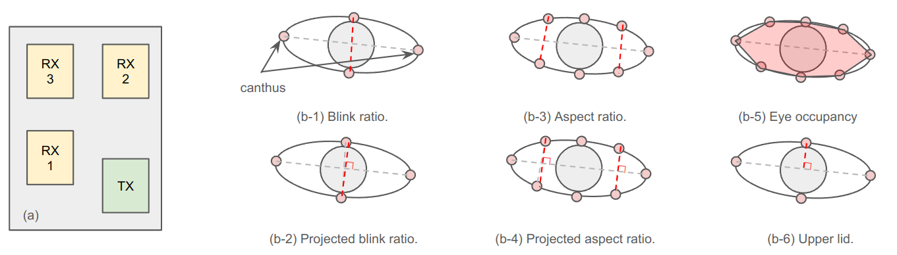

# Overview

This folder serves as the default data directory for the project. The script `scripts/download.py` will download and
save the necessary data files to this location.

## Dataset structure

### Raw Dataset

The raw dataset contains 124 experiment sessions from 20 anonymized subjects, identified by numbers from `01` to `20`.
Each subject completed 5 to 7 sessions, with each session lasting about 5 minutes.

During the sessions:

- Subjects wore the BlinkWise device.
- Eye openness was recorded using a mobile phone camera in slo-mo mode.
- Each session consisted of two phases:
    1. **Controlled blinking:** Subjects blinked in response to 10 beep sounds.
    2. **Natural blinking:** Subjects blinked naturally for 5 minutes.

To synchronize radar data with video frames, a green LED was attached to the BlinkWise device. The LED was controlled by
the MCU to flash for 0.01 seconds every 10.02 seconds. The LED flashes were detected in the video frames, and MCU
timestamps were used to align the video frames with the radar data.

Due to IRB restrictions, video recordings from the experiments cannot be shared. Instead, the dataset includes processed
facial landmarks and corresponding eye openness measurements as ground truth.

The raw dataset is structured as follows:

```
data/raw-dataset
├── exp-YYYYMMDD-HHMMSS/
│   ├── metadata.json         # Metadata of the session
│   ├── radar_data.npy        # Radar data from the session
│   ├── radar_timestamps.npy  # Timestamps corresponding to radar data
│   ├── video_timestamps.npy  # Timestamps of each video frame
│   └── label.csv             # Facial landmarks and eye openness measurements
│                             # (one row corresponds to one video frame)
├── ...
└── deny_list.json            # Segments excluded from training and evaluation, 
                              # marked as [start, end) video frame indices
```

The `metadata.json` file includes:

- `subject`: String. Anonymized subject ID.
- `session`: Integer. Session number.
- `laptop_single_blink_start` and `laptop_single_blink_end`: Lists of timestamps marking the start and end of the 10
  beep sounds during the controlled blinking phase.
- `laptop_free_blink_start` and `laptop_free_blink_end`: Lists with one timestamp each, marking the start and end of the
  natural blinking phase.
- `laptop_entire_start` and `laptop_entire_end`: Lists with one timestamp each, marking the start and end of the entire
  session.
- `laptop_timestamp_offset`: Float. Timestamp offset between the laptop and the MCU.

The `label.csv` file contains the following columns:

1. **Eye Landmarks**  
   `left_<landmark_index>_x` and `left_<landmark_index>_y` represent the x and y coordinates of the left eye
   landmarks.  
   `right_<landmark_index>_x` and `right_<landmark_index>_y` represent the x and y coordinates of the right eye
   landmarks.  
   Landmark indices range from 0 to 7 and correspond to
   the [WFLW dataset definition](https://wywu.github.io/projects/LAB/WFLW.html):
    - Left eye: 0–7 → [68, 69, 70, 71, 72, 73, 74, 75].
    - Right eye: 0–7 → [60, 61, 62, 63, 64, 65, 66, 67].

2. **Projected Blink Ratios**  
   `left_projected_blink_ratio` and `right_projected_blink_ratio` provide the eye openness measurements for the left and
   right eyes. These are defined as the distance between the middle of the upper and lower eyelids, divided by the
   distance between the inner and outer canthus, and projected onto the perpendicular line connecting the inner and
   outer canthus. See Figure 1(b-2).

3. **Manual Blink Annotations**  
   `init_labels` indicates whether a frame corresponds to the start of any phase of a blink (referred to as the "spiky
   form"). These labels are not used for evaluation, as the project employs an automated blink phase detection method.
   However, they are used to identify the start and end of blinks for dataset construction and sampling.

Additional columns are also included in the `label.csv` file (though not used in the project):

1. **Focus Points**  
   `focus_<index>_x` and `focus_<index>_y` provide the x and y coordinates of focus points. These are used to calculate
   bounding boxes for the eyes.  
   Indices range from 0 to 3, corresponding to WFLW landmarks:
    - [33, 46, 51, 52]: Left-most/right-most eyebrows, between the eyes, and the middle of the nose bridge.

2. **Nose Landmarks**  
   `nose_<index>_x` and `nose_<index>_y` represent the x and y coordinates of nose landmarks.  
   Indices range from 0 to 1, corresponding to WFLW landmarks:
    - [53, 54]: Lower nose ridge and nose tip.

3. **Blink Ratios**
    - `left_blink_ratio` and `right_blink_ratio`:  
      Defined as the distance between the middle of the upper and lower eyelids, divided by the distance between the
      inner and outer canthus. See Figure 1(b-1).

4. **Eye Aspect Ratios**
    - `left_eye_aspect_ratio` and `right_eye_aspect_ratio`:  
      Calculated as the mean of the distances between the middle of the eyelids and the canthi, divided by the distance
      between the inner and outer canthus. See Figure 1(b-3).
    - `left_projected_eye_aspect_ratio` and `right_projected_eye_aspect_ratio`:  
      Similar to the above but projected onto the perpendicular line of the inner-outer canthus connection. See Figure
      1(b-4).

5. **Eye Occupancy**  
   `left_eye_occupancy` and `right_eye_occupancy` are defined as the polygon area formed by eyelid landmarks, divided by
   the square of the distance between the inner and outer canthus. See Figure 1(b-5).

6. **Upper-lid**
   Defined as the distance between the middle of the upper eyelid to the line connecting the inner and outer canthus.
   See Figure 1(b-6).

7. **Bounding Boxes**
    - Left eye: `left_bbox_x`, `left_bbox_y`, `left_bbox_w`, and `left_bbox_h` represent the top-left corner
      coordinates, width, and height of the bounding box.
    - Right eye: `right_bbox_x`, `right_bbox_y`, `right_bbox_w`, and `right_bbox_h` provide the same for the right eye.

8. **Miscellaneous**  
   `manually_checked` is not used in the project. All values are set to `-1`.

The radar data is a numpy array of shape `(N, 3, 1, 128)`, where N is the number of radar frames in the session, 3 is
the number of antennas, 1 is the number of chirps, and 128 is the number of chirp samples. See Figure 1(a) for the radar
sensor installation orientation.

The radar timestamps is a numpy array of shape `(N,)`, where N is the number of radar frames in the session. For two
sessions, the MCU was not corrected synced with the Internet NTP servers, so the timestamps are indicates the time since
the MCU was turned on. For these cases, both video timestamps and laptop event timestamps are corrected to the MCU
timestamps.

The video timestamps is a numpy array of shape `(M,)`, where M is the number of video frames in the session.

The `deny_list.json` file contains a list of segments that are excluded from training and evaluation. These segments are
excluded because of occasional video frame loss or excessive motion.

<div style="text-align: center;">
    
    <p><strong>Figure 1.</strong> (a) Layout of the radar sensor antennas, shown from the viewer's perspective. (b) Various definitions of eye openness, illustrating key measurement approaches.</p>
</div>

### The processed dataset

The processed dataset is generated using a pipeline that:

- Filters radar signals within a specific range bin (2.5 to 5.5 cm) using a differentiator and a low-pass filter.
- Smooths and normalizes eye openness values to a range of 0 to 1.

The processed dataset is organized as follows:

```
data/processed-dataset
├──exp-YYYYMMDD-HHMMSS
│   ├── metadata.json                   # Metadata of the session
│   ├── input.npy                       # Processed radar data
│   ├── label.npz                       # Compressed file with {video: manual labels, fsm: event proposal labels}
│   │                                   #   Labels are in the continuous form (i.e., each frame has a label)
│   ├── target_ratio.npz                # Compressed file with {projected_blink_ratio: array}
│   └── processing_protocol.txt         # Details of the processing protocol of RF data
├── ...
├── processing_config.json              # Configuration parameters for data processing
└── rf_deny_list.json                   # Excluded segments in radar frame indices
```

[`src/data/dataset/dataset_specification.py`](../src/data/dataset/dataset_specification.py) provides more information on
the processing protocol (i.e., a sequence of steps to apply to the raw data) and the processing config (parameters).

The `rf_deny_list.json` file contains a list of segments that are excluded from training and evaluation. It includes
`deny_list.json` in radar frame indices, plus segments with radar frame loss detected or LED sync failed.

## Pre-trained artifacts

The directory structure for pre-trained artifacts is as follows:

```
data/reproducing-results
└── <model_name>_<YYYYMMDD_HHMMSS>
    ├── checkpoint
    │   ├── <model_name>.keras          # Trained model (float-point precision)
    │   └── quantized_model.tflite      # Quantized model
    ├── summary                         # TensorBoard summaries and visualizations
    ├── config.json                     # Configuration of the training run
    ├── config_summary.md               # Human-readable configuration summary
    ├── history.json                    # Training history
    └── model.png                       # Visualization of the model architecture
```

If you do not see `model.png` in your own training results, it is likely due to the absence of the `graphviz` package.
Please see `Installation` section in the project [`README.md`](../README.md#installation).

Fields in `config.json` are documented in the `src/models/config` module.

## Case study datasets

The directory structure for case study datasets is as follows:

```
data/case-studies
├── drowsiness_blink_parameters.csv     # blink parameters and drowsiness measures
└── workload_blink_parameters.csv       # blink parameters under different workload levels
```

### Drowsiness case study

We conducted a 12-hour longitudinal study with 8 participants. Participants wore BlinkWise from morning to evening, with
the system running for one 5-minute session every hour. After each session, participants completed two drowsiness
assessments: the subjective Karolinska Sleepiness Scale (KSS) (1: extremely alert to 9: extremely sleepy) and the
objective Psychomotor Vigilance Task (PVT). PVT measures reaction time (RT) to visual stimuli, with longer mean RT
indicating higher drowsiness levels. In PVT, dots with random spacing in time will be displayed on the screen and the
subject is asked to tap the screen as soon as possible. One tap is referred to as one reaction in the following
descriptions.

The `drowsiness_blink_parameters.csv` file includes blink parameters and paired KSS and PVT RT statistics. Each row
represents measurements every hour. The fields are:

1. `subject_id` and `session`: keys to index different experiment sessions.
2. `n_blinks` and `n_non_blinks`: the number of blinks and inter-blink intervals detected. #Intervals are one less than
   #blinks.
3. `[closing/closed/reopening/blink/open]_time_[mean/std/median]`: different statistics for durations of different blink
   phases. Blink time refers to the sum of closing, closed, and reopening time.
4. `n_pvt_measurements`: the number of reaction time measured in 5-minute PVT.
5. `pvt_[mean/std/median]`: statistics of reaction time. measured in ms.
6. `pvt_lapses`: the number of reactions with time longer than 500 ms.
7. `pvt_[fast/slowest]10p`: the mean reaction time for the fastest/slowest 10% reactions.
8. `kss_score`: subjective labeling of drowsiness level.

### Workload case study

We conducted a visual search experiment with 10 healthy participants. The task required participants to identify an
outlier circle among distractors under three 3-minute conditions: baseline (passive viewing), easy search (fewer
distractors), and hard search (more distractors). Each session was separated by a two-minute rest interval.

The `workload_blink_parameters.csv` file includes blink parameters under different difficulties. Each row represents a
single blink (and the non-blink interval before it). The fields are:

1. `subject_id` and `condition`: to which subject and difficulty level the blink belongs to.
2. `[closing/closed/reopening/blink/open]_time`: the duration of different blink phases. Blink time refers to the sum of
   closing, closed, and reopening time.
